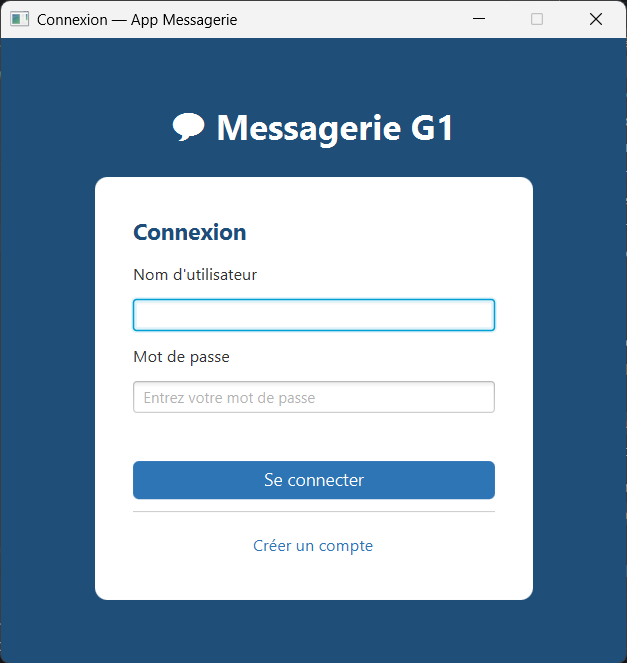
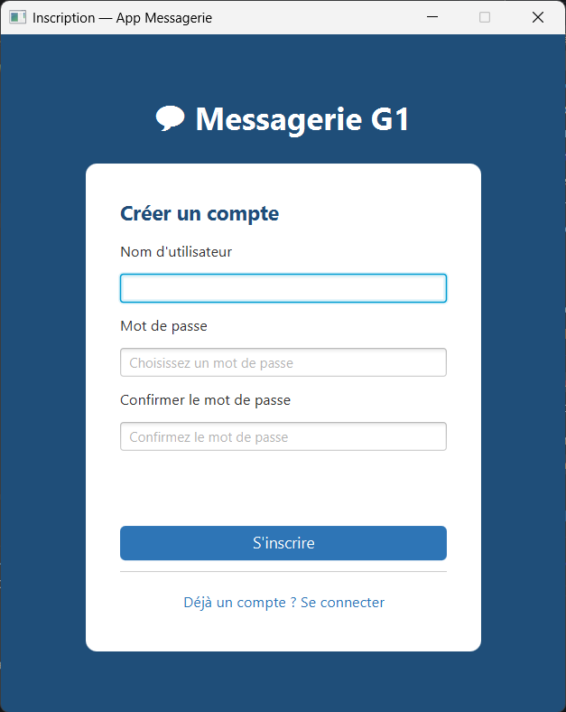
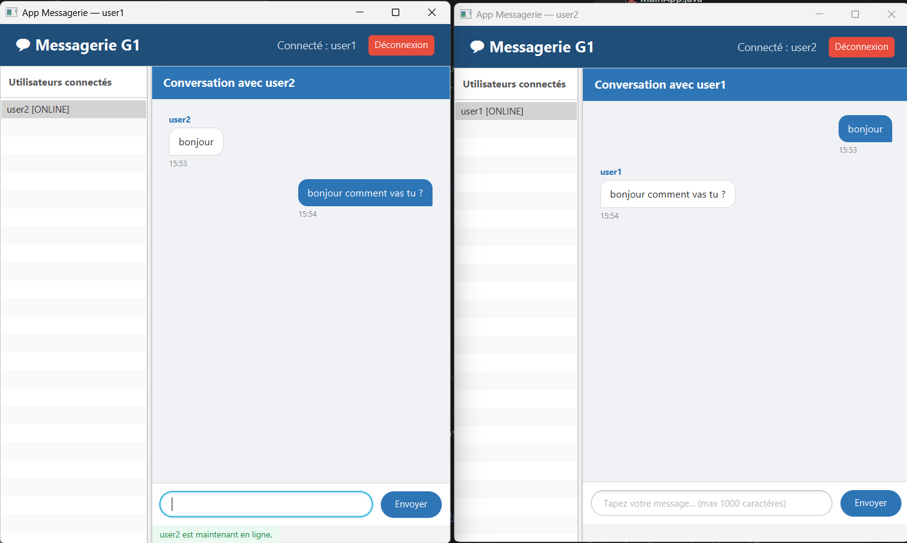

# 💬 Application de Messagerie Instantanée (Type WhatsApp) - G1


Projet scolaire d'application de messagerie interne permettant aux utilisateurs de communiquer en temps réel via un système client-serveur robuste. Ce projet applique les concepts de Programmation Orientée Objet (POO), de concurrence (Threads) et de persistance des données.

---

## 🛠️ Stack Technique

- **Langage principal** : Java 17
- **Interface Graphique** : JavaFX
- **Réseau** : Sockets Java (`ServerSocket`, `Socket`)
- **Persistance des données** : Hibernate / JPA
- **Base de données** : MySQL ou PostgreSQL
- **Architecture** : Client-Serveur
- **Gestion de projet et dépendances** : Maven
- **IDE recommandé** : IntelliJ IDEA

---

## 🏗️ Architecture du Projet

Le projet est divisé en deux parties principales. Pour faciliter le développement en équipe, ces parties sont gérées sur des branches GitHub séparées respectant l'architecture logique :

### 🖥️ Branche `feature/server` (Côté Serveur)
Gère les connexions, la logique métier centralisée et la persistance.
- `server/ServerMain.java` : Point d'entrée du serveur.
- `server/ClientHandler.java` : Gestion d'un client de manière concurrente (dans un thread dédié).
- `server/ServerLogger.java` : Journalisation des événements du serveur.
- `model/User.java` & `model/Message.java` : Entités Hibernate.
- `dao/UserDAO.java` & `dao/MessageDAO.java` : Couches d'accès aux données.
- `util/PasswordUtil.java` : Hachage sécurisé des mots de passe.
- `resources/hibernate.cfg.xml.example` : Modèle de configuration pour la base de données (sans credentials sensibles).

### 💻 Branche `feature/client` (Côté Client)
Gère l'interface graphique JavaFX et la communication réseau avec le serveur.
- `client/ClientMain.java` : Point d'entrée du client JavaFX.
- `client/ClientSocket.java` : Gestion de la connexion au serveur.
- `client/MessageListener.java` : Thread de réception des messages en temps réel.
- `controller/LoginController.java` : Gestion de la connexion et de l'inscription.
- `controller/ChatController.java` : Gestion de l'envoi et de la réception des messages.
- `controller/UserListController.java` : Affichage de la liste des utilisateurs connectés.
- `resources/fxml/*.fxml` : Vues de l'interface graphique (Login, Chat, UserList).
- `resources/css/style.css` : Feuilles de style pour customiser l'application.

---

## 📊 Modèle de Données

Le modèle de données repose sur deux entités principales gérées par Hibernate (ORM) :

### 👤 Entité `User`
- `id` (Long, auto-généré)
- `username` (String, **unique**)
- `password` (String, **haché**)
- `status` (Enum : `ONLINE` / `OFFLINE`)
- `dateCreation` (LocalDateTime)

### ✉️ Entité `Message`
- `id` (Long, auto-généré)
- `sender` (User)
- `receiver` (User)
- `contenu` (String, **max 1000 caractères**)
- `dateEnvoi` (LocalDateTime)
- `statut` (Enum : `ENVOYE` / `RECU` / `LU`)

---

## ✨ Fonctionnalités

### 🔐 Gestion des comptes
- **Inscription** avec un nom d'utilisateur unique (RG1).
- **Connexion / Déconnexion** sécurisée.
- Gestion du statut `ONLINE` / `OFFLINE` de l'utilisateur (RG4).
- Un seul login simultané autorisé par compte utilisateur (RG3).
- **Sécurité** : Mots de passe stockés hachés en base de données (RG9).

### 💬 Messagerie
- Envoi de messages texte à un autre utilisateur (RG5).
- Réception des messages en **temps réel**.
- **Mode asynchrone / hors-ligne** : Messages différés si le destinataire est hors ligne lors de l'envoi (RG6).
- Historique de conversation affiché par ordre chronologique (RG8).
- Affichage dynamique de la liste des utilisateurs connectés.
- Validation des messages : non vide et limité à 1000 caractères (RG7).

### ⚙️ Aspects Techniques Avancés
- Chaque client connecté est géré de manière asynchrone dans un **thread séparé** côté serveur (RG11).
- **Journalisation stricte** des connexions, déconnexions et flux d'envoi côté serveur (RG12).
- Mécanisme de rattrapage et notification en cas de perte de connexion côté client (RG10).

---

## 🔀 Workflow GitHub

Afin de fluidifier le travail asynchrone, le projet utilise les branches suivantes :
- **Branche `main`** : Contient la version stable, fonctionnelle et fusionnée du projet.
- **Branche `feature/client`** : Dédiée au développement de l'interface JavaFX (Front-End & Client TCP).
- **Branche `feature/server`** : Dédiée au développement du serveur, de la persistance et de la base de données.
> Les branches `feature` sont fusionnées sur `main` via des *Pull Requests*.

---

## 👥 Équipe

| Rôle | Nom | Branche GitHub |
|------|-----|----------------|
| 💻 Développement Client (JavaFX) | Sokhna Bousso Wagnane | `feature/client` |
| 🖥️ Développement Serveur (Sockets + BDD) | Exhorte BABOKA MBOUMBA | `feature/server` |

---

## 📸 Aperçu de l'application

### Écran de connexion / inscription


### Liste des utilisateurs connectés


### Interface de chat


> Les captures d'écran sont disponibles dans le dossier `screenshots/` à la racine du projet.

---

## ⚙️ Prérequis et Installation

### Prérequis
- Java 17+
- Maven
- MySQL ou PostgreSQL
- IntelliJ IDEA

### Installation pas-à-pas

1. **Cloner le dépôt**
   ```bash
   git clone https://github.com/sokhna99/messagerie-G1.git
   cd messagerie-G1
   ```

2. **Créer la base de données**  
   Créez une base de données dans votre SGBD (MySQL / PostgreSQL).

3. **Configurer la base de données**  
   Copiez le fichier de configuration exemple vers le fichier final :
   ```bash
   cp src/main/resources/hibernate.cfg.xml.example src/main/resources/hibernate.cfg.xml
   ```
   *Pensez à éditer `hibernate.cfg.xml` et à renseigner vos identifiants.*

4. **Compiler l'application**
   ```bash
   mvn clean install
   ```

---

## 🚀 Lancer le projet

1. **Démarrer le Serveur**  
   Lancez la classe `ServerMain.java` (branche `feature/server`). Le serveur écoutera les requêtes entrantes.

2. **Démarrer le Client**  
   Lancez la classe `ClientMain.java` (branche `feature/client`). Vous pouvez lancer plusieurs instances pour simuler différentes connexions.

---

## 📄 Licence

MIT
